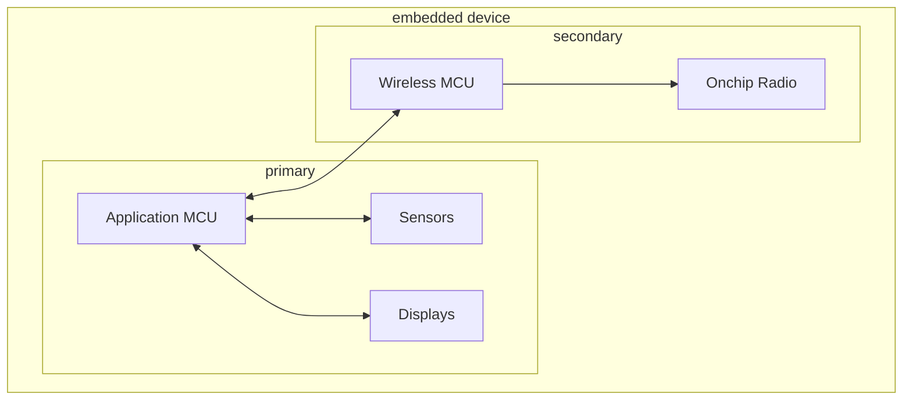

```mermaid
flowchart TD
subgraph embedded device
    subgraph primary
        AM[Application MCU]<-->Sensors
        AM<-->Displays
    end
    subgraph secondary
        WM[Wireless MCU]--->radio[Onchip Radio]
    end
    AM<-->WM
end
```
